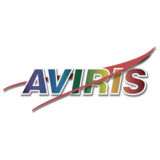

# AVIRIS

The Airborne Visible InfraRed Imaging Spectrometer - Classic ([AVIRIS-C](https://aviris.jpl.nasa.gov/)), Next Generation ([AVIRIS-NG](https://avirisng.jpl.nasa.gov/)), and 3rd Generation (AVIRIS-3) are three Facility Instruments (FIs) that are part of NASA's Airborne Science Program (ASP) and the Jet Propulsion Laboratory's (JPL) Earth Science Airborne Program. 

Data from AVIRIS-C, AVIRIS-NG, and AVIRIS-3 are applicable to a wide range of studies in the fields of terrestrial and coastal aquatic plant physiology, atmospheric and aerosol studies, environmental science, snow hydrology, geology, volcanology, oceanography, soil and land management, agriculture, and limnology.

AVIRIS datasets are available at https://daac.ornl.gov/cgi-bin/dataset_lister.pl?p=47.

## AVIRIS-C Datasets
The AVIRIS-C is an imaging spectrometer that delivers calibrated images of the upwelling spectral radiance in 224 contiguous spectral channels with wavelengths from 400 to 2500 nanometers (nm). 

| Data Product |
| --- |
| [L1B Calibrated Radiance, Facility Instrument Collection](https://doi.org/10.3334/ORNLDAAC/2155) |
| [L2 Calibrated Reflectance, Facility Instrument Collection](https://doi.org/10.3334/ORNLDAAC/2154) |

## AVIRIS-NG Datasets
The AVIRIS-NG is the successor to AVIRIS-Classic and provides high signal-to-noise ratio imaging spectroscopy measurements in 425 contiguous spectral channels with wavelengths in the solar reflected spectral range (380-2510 nm) with 5 nm sampling. The AVIRIS-NG started operation in 2014 and is expected to replace the AVIRIS-C instrument. 

| Data Product |
| --- |
| [L1B Calibrated Radiance, Facility Instrument Collection](https://doi.org/10.3334/ORNLDAAC/2095) |
| [L2 Surface Reflectance, Facility Instrument Collection](https://doi.org/10.3334/ORNLDAAC/2110) |

## AVIRIS-3 Datasets
The AVIRIS-3 is the third of the AVIRIS spectrometer FI series and has higher signal-to-noise ratio performance than AVIRIS-C or AVIRIS-NG. The core spectrometer of AVIRIS-3 is an optically fast, F/1.8 Dyson imaging spectrometer spanning a wide width (39.5-degree field of view). The AVIRIS-3 provides measurements in 285 contiguous spectral channels with wavelengths in the solar reflected spectral range (390-2500 nm) with 7.4 nm sampling. The AVIRIS-3 started operation in 2023. 

| Data Product |
| --- |
| [L1B Calibrated Radiance, Facility Instrument Collection](https://doi.org/10.3334/ORNLDAAC/2356) |
| [L2A Orthocorrected Surface Reflectance, Facility Instrument Collection](https://doi.org/10.3334/ORNLDAAC/2357) |
| [L2B Greenhouse Gas Enhancements, Facility Instrument Collection](https://doi.org/10.3334/ORNLDAAC/2358) |

## Data Tutorials
- [AVIRIS Data - Discovery, Access and Analysis](../../events/2025-SBG/notebooks/AVIRIS-NG_L3_BioSCape.ipynb)