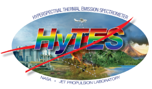

# HyTES

The Hyperspectral Thermal Emissions Spectrometer (HyTES) instrument has 512 pixels across track with pixel sizes in the range of 5 to 50 m depending on aircraft flying height and 256 spectral channels between 7.5 and 12 micrometer. 

HyTES started science flights in 2012. Since then HyTES has flown on Twin Otter aircraft from Twin Otter International and the British Antarctic Survey, [NASA ER-2](https://airbornescience.nasa.gov/aircraft/ER-2_-_AFRC) and [NASA Gulfstream V](httphttps://airbornescience.nasa.gov/aircraft/Gulfstream_V_-_JSC).

More information about HyTES and its data products are available here: https://hytes.jpl.nasa.gov/

## Data Products
| Data Product |
| --- |
| Level 1a - Calibrated but not geocoded Level 1 Brightness Temperature at Sensor | 
| Level 1b - Calibrated and geolocated Level 1 Brightness Temperature at Sensor |
| Level 2 - HyTES Level 2 Data for Emissivity and Land Surface Temperature |
| Level 3 - Multi-species gas products (geolocated) CH4, H2S, S02, N02 |

## Data Tutorials

- [Accessing and Visualizing HyTES data](../../events/2025-SBG/notebooks/hytes_access.ipynb)