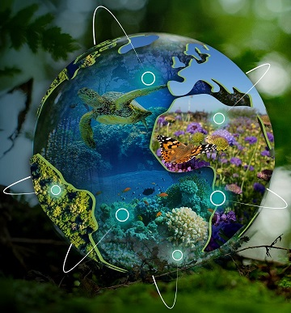

# BioSpace25 Workshop

## Harnessing analysis tools for biodiversity applications using field, airborne, and orbital remote sensing data from NASA's BioSCAPE campaign

**Date:** February 12, 2025, Frascati (Rome), Italy

**Instructors:**  Michele Thornton (NASA Earthdata), Rupesh Shrestha (NASA Earthdata), Erin Hestir-PI (UC Merced), Adam Wilson-PI (University at Buffalo), Jasper Slingsby-PI (University of Cape Town), Anabelle Cardoso-PM (University of Cape Town, University at Buffalo)

## Overview
In October/November of 2023, the US National Aeronautics and Space Administration (NASA) conducted its first Biodiversity field and airborne campaign across terrestrial and aquatic environments in the South African Greater Cape Floristic Region (GCFR). From 4 airborne instruments (Airborne Visible-Infrared Imaging Spectrometer - Next Generation (AVIRIS-NG), Portable Remote Imaging SpectroMeter (PRISM), Hyperspectral Thermal Emission Spectrometer (HyTES), and Land, Vegetation, and Ice Sensor (LVIS)) the BioSCape Campaign’s remote sensing data products provides an unprecedented level of image spectroscopy from VSWIR to TIR wavelengths as well as full-waveform laser altimeter measurements. Airborne data are supplemented with a rich combination of contemporaneous biodiversity-relevant field observations toward an approach to measure and understand functional, phylogenetic, and taxonomic biological diversity as components of ecosystem function.

A majority of the BioSCape Campaign data will be archived through the NASA-funded Oak Ridge National Laboratory Distributed Active Archive Center (ORNL DAAC). The discipline-specific Center provides dataset content to NASA’s Earthdata Cloud which includes a standardized metadata called Common Metadata Repository (CMR), data discovery, and open access.

This hands-on demonstration will leverage a managed cloud environment to show programmatic discovery, access, and analysis of NASA BioSCape data/resources and concurrent orbital data. Included will be content and tutorials demonstrating derivation of estimates of biodiversity variables including:

- An overview of the BioSCape Campaign data acquisition
- NASA Earthdata Cloud: Search, Access, and Analysis Basics
- Explore BioSCape vegetation plot and image spectroscopy data
- Invasive species analysis from AVIRIS-NG and Vegetation Plot Data
- Vegetation Structural Diversity derived from LVIS and GEDI full waveform lidar data.
- Aquatic biodiversity estimates from PRISM, PACE, and EMIT

## Notebooks

- [Workshop page](https://nasa-openscapes.github.io/2025-biospace/)
    - [Tutorial: Mapping Invasive Species Using Supervised Machine Learning and AVIRIS-NG](https://nasa-openscapes.github.io/2025-biospace/tutorials/avirisng/avng_invasive_esaworkshop.html)
    - [Tutorial: Exploring and Visualizing BioSCape LVIS Data](https://nasa-openscapes.github.io/2025-biospace/tutorials/lvis/lvis.html)