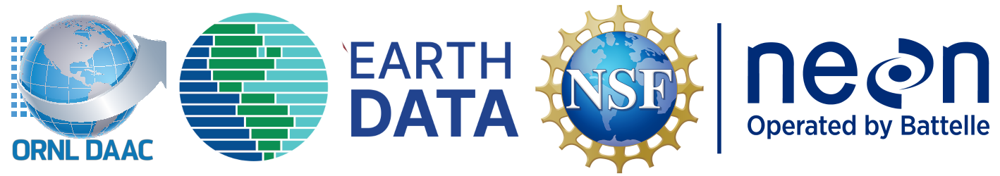

# ESA 2025 Workshop

## Plot to Plane: Working with NASA and NEON Airborne and Field Datasets

**Date:** Tuesday August 15, 2025

**Instructors:**  Michele Thornton, Bridget Hass, Rupesh Shrestha

## Overview
NASA’s airborne science program and the NSF-funded National Ecological Observatory Network’s (NEON’s) Airborne Observation Platform (AOP) offer complementary remote sensing datasets ideal for carrying out large-scale ecological research. Both facilities operate similar airborne imaging spectrometers to collect visible to shortwave infrared (VSWIR) hyperspectral data, supporting regional ecosystem studies.

The Oak Ridge National Laboratory Distributed Active Archive Center (ORNL DAAC) archives data from NASA-funded ecological campaigns focusing on diverse environments such as river deltas and wetlands, the arctic, and tropics across multiple continents (North and Central America, South Africa). NEON’s AOP gathers high-resolution hyperspectral imagery, lidar, and RGB photography at 81 U.S. sites, offering repeat data spanning 2-10 years, with collections starting in 2013.

This workshop introduces NEON and NASA airborne and field datasets through live-coding exercises presented as Python Jupyter Notebook tutorials, demonstrating data access, exploration, and analysis. Participants will learn to apply these datasets to answer ecological research questions, gaining insights into regional and landscape areas of interest.

This workshop is hosted by [National Ecological Observatory Network (NEON)](https://neonscience.org/), NASA [Oak Ridge National Laboratory Distributed Active Archive Center (ORNL DAAC)](https://daac.ornl.gov/) with support from the NASA [Openscapes](https://nasa-openscapes.github.io/) project.

Hands-on exercises will be executed from a[Jupyter Hub on the Openscapes 2i2c cloud instance](https://workshop.openscapes.2i2c.cloud/). Instructions for setting up the Python environment locally are provided in the [prerequisites](../../docs/prerequisites.md).

## Slides

<iframe src="" frameborder="0" width="750" height="450" allowfullscreen="true" mozallowfullscreen="true" webkitallowfullscreen="true"></iframe>

## Agenda
## Agenda

| Time | Description | Leads/Instructors |  
|------|---------------------|-------------| 
|8:00 AM|Introduction: NEON and NASA Airborne and Field Data|Bridget Hass and Michele Thornton|  
|8:05 AM|Overview of NEON Airborne Observation Platform|Bridget Hass|  
|8:30 AM|NEON Notebooks: Reflectance Visualization and Classification|Bridget Hass|
|9:30 AM|Break||
|9:35 AM|Overview of Recent NASA Airborne Missions (SHIFT, BioSCape, AVUELO)|Michele Thornton|  
|10:00 AM|NASA Notebooks: Discovery and Analysis of VegPlot and AVIRIS Instrument Data|Michele Thornton| 
|10:55 AM|Discussion and Wrap Up|All|

## Notebooks

- [AVIRIS Data - Discovery, Access, and Visualization](../../notebooks/AVIRIS-NG_L3_BioSCape.ipynb)
- [Mapping Invasive Species Using Supervised Machine Learning and AVIRIS-NG](../../notebooks/AVIRIS-NG_L3_invasive_species.ipynb)