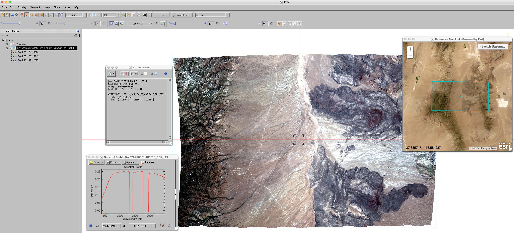

# Working with AVIRIS-5 in ENVI

AVIRIS-5 datasets are provided in netCDF-4 format. In this tutorial, we will learn how to convert AVIRIS-5 netCDF file to ENVI format and open in the geospatial analysis software [ENVI](https://www.nv5geospatialsoftware.com/Products/ENVI).


## Download L1B granule

For this tutorial, we will use a granule [AV520250801t165910_005_L1B](https://search.earthdata.nasa.gov/search/granules?p=C4076410273-ORNL_CLOUD&pg[0][v]=f&pg[0][id]=*AV520250801t165910_005_L1B*) as an example. Go the [granule link](https://search.earthdata.nasa.gov/search/granules?p=C4076410273-ORNL_CLOUD&pg[0][v]=f&pg[0][id]=*AV520250801t165910_005_L1B*), login using Earthdata login, and download the granule as shown below.


## Convert AVIRIS-5 netCDF to ENVI format

Python [`SpectralUtil` tools](https://github.com/emit-sds/SpectralUtil) supports conversion of AVIRIS-5 netCDF4 formatted files to ENVI format. We will use `SpectralUtil` to convert the downloaded netCDF file.

First, install the `SpectralUtil` using the `pixi`. Follow the instructions [here](https://pixi.prefix.dev/latest/#installation) to install pixi if it is not alerady installed. 

```
git clone git@github.com:emit-sds/SpectralUtil.git
cd SpectralUtil
pixi install
```

Now, we can use `pixi run` to run the following command

```
spectral_util reformat nc-to-envi AV520250801t165910_005_L2A_OE_da8b3ef7_RFL_ORT.nc AV520250801t165910_005_L2A_OE_da8b3ef7_RFL_ORT.bin
```


## 3. Open the file in ENVI

Once the conversion is complete, the output file `AV520250801t165910_005_L2A_OE_da8b3ef7_RFL_ORT.bin` can be directly opened into ENVI. You can also click `Views > Reference Map Link` to check the location of the image. And, click `Display > Profiles > Spectral` to display spectral profile of a pixel, and `Display > Cursor Value` to display cursor value and location.

