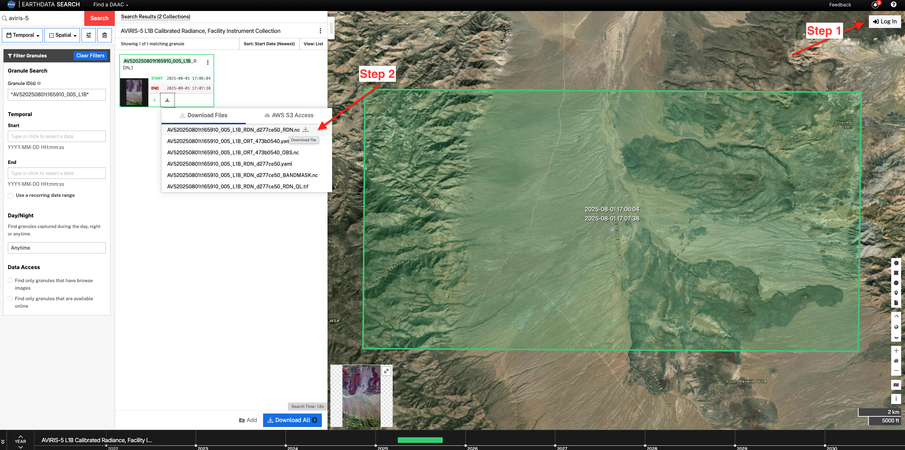
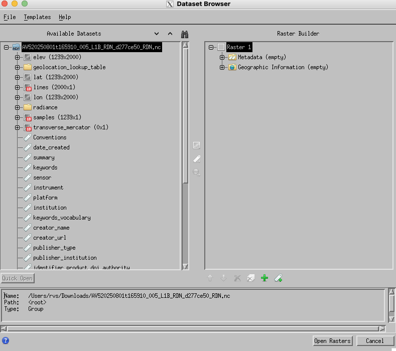
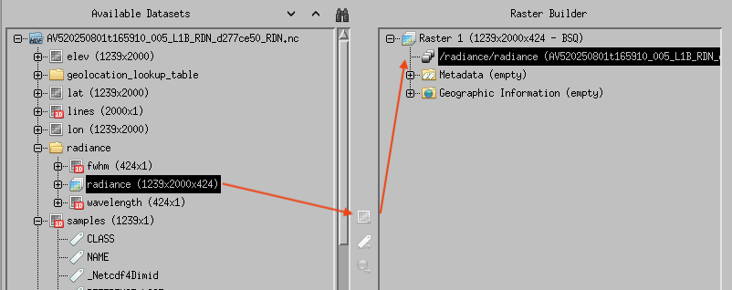
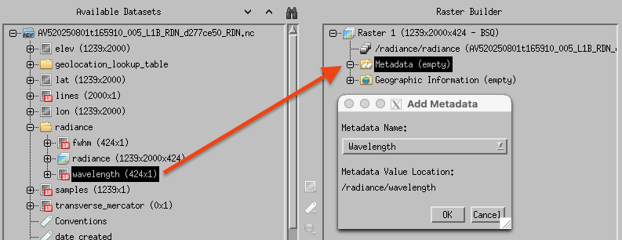
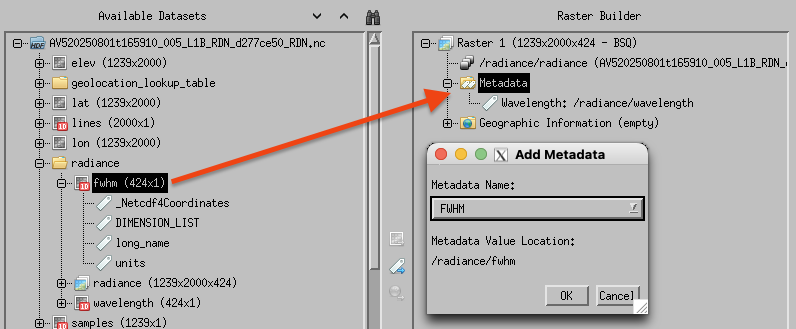
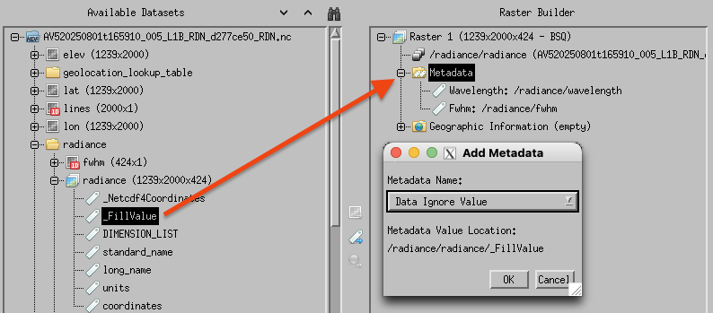
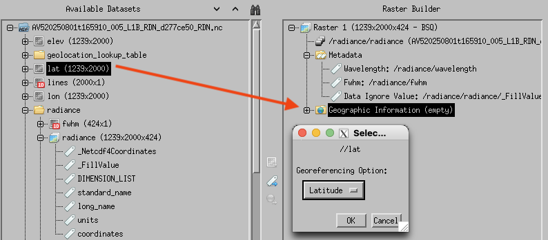
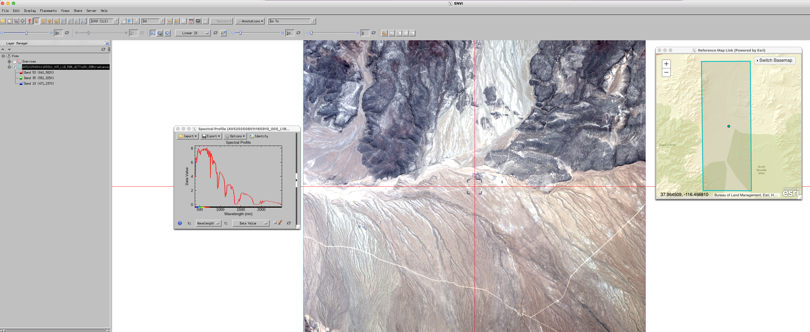

# Open AVIRIS-5 netCDF-4 files in ENVI

AVIRIS-5 datasets are provided in netCDF-4 format, which can be opened in the geospatial analysis software [ENVI](https://www.nv5geospatialsoftware.com/Products/ENVI). In this tutorial, we will learn how to open a AVIRIS-5 netCDF file correctly in ENVI software.

## 1. Download L1B granule

For this tutorial, we will use a granule [AV520250801t165910_005_L1B](https://search.earthdata.nasa.gov/search/granules?p=C4076410273-ORNL_CLOUD&pg[0][v]=f&pg[0][id]=*AV520250801t165910_005_L1B*) as an example. Go the [granule link](https://search.earthdata.nasa.gov/search/granules?p=C4076410273-ORNL_CLOUD&pg[0][v]=f&pg[0][id]=*AV520250801t165910_005_L1B*), login using Earthdata login, and download the granule as shown below.

## 2. Open AVIRIS-5 granule in ENVI
Open ENVI and go to `File > Open As > Scientific Formats > HDF5/NetCDF-4`. 

In the next window, select the file. This will be display a "Dataset Browser" as shown below. The following browser is from ENVI 6.2, yours might look little different based on what version of the software you are using. 

## 3. Raster builder
Now, we will map the netCDF dataset to the raster building as 1) dataset, 2) metadata, and 3) georeference.

### Dataset
Since this is a Level 1B radiance file, we will first add `/radiance/radiance` variable to the `Raster 1` as shown below.

### Metadata Fields
We will add additional metadata field to the raster builder. Some of the important metadata fields are shown below.

`/radiance/wavelength` to `Metadata -> Wavelength`

`/radiance/fwhm` to `Metadata -> FWHM`

`/radiance/radiance/_FillValue` to `Metadata -> Data Ignore Value`

### Georeference
Now, assign both `lat` and `lon` coordinates to the "Geographic Information" fields

`/lon` to `Geographic Information -> Longitude` and
`/lat` to `Geographic Information -> Latitude`

## 4. ENVI

Once all required datasets are mapped, click "Open Rasters" button to open the AVIRIS-5 file into ENVI. You can also click `Views > Reference Map Link` to check the location of the image. And, click `Display > Profiles > Spectral` to display spectral profile of a pixel.

